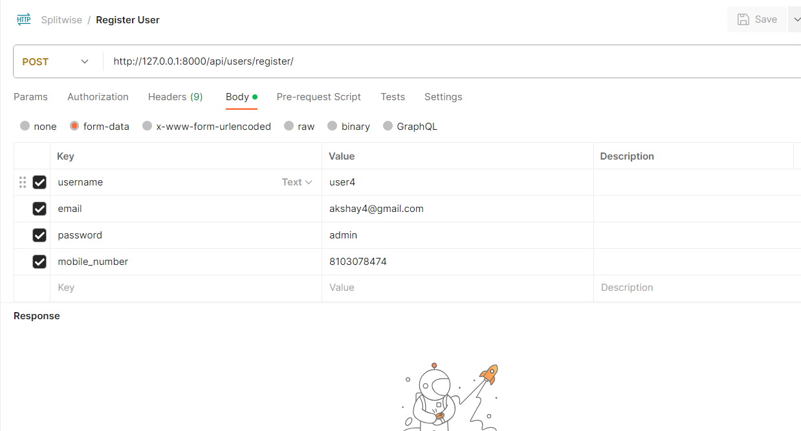
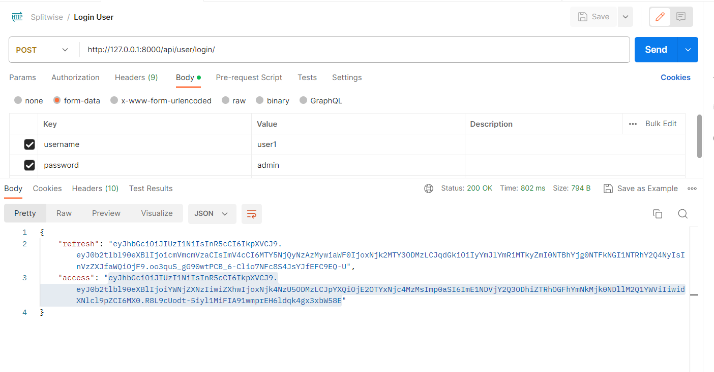
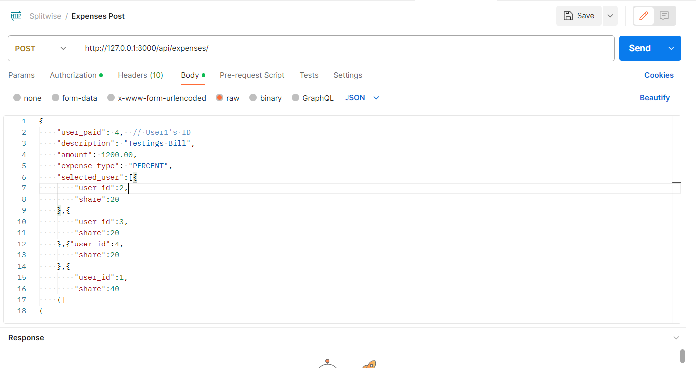
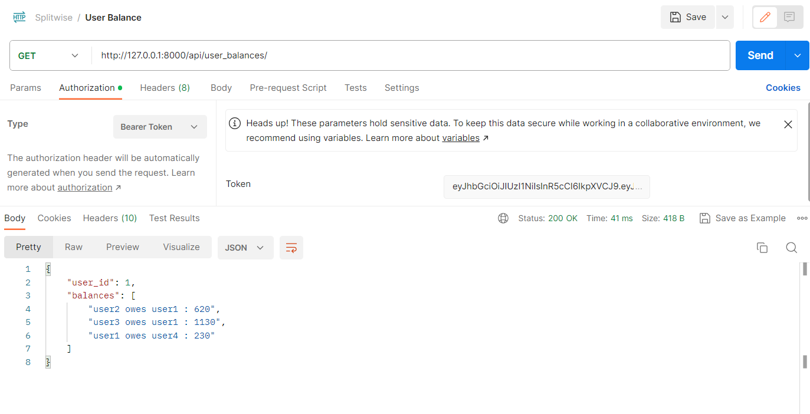
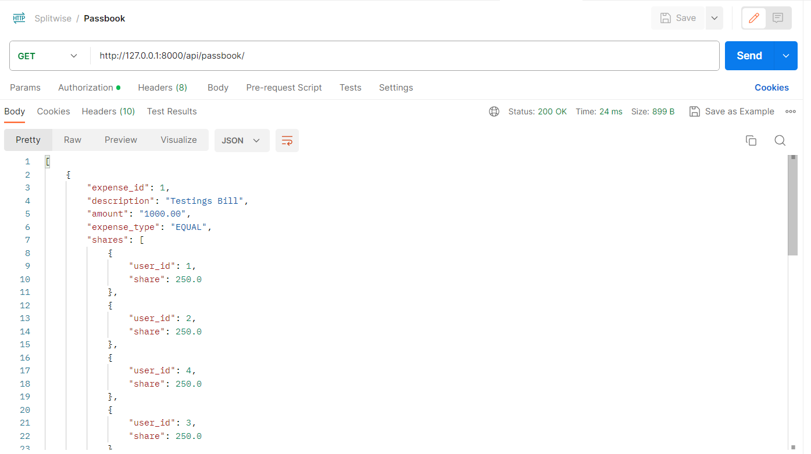

TestJob
An expense sharing application is where you can add your expenses and split it among
different people. The app keeps balances between people as in who owes how much to
whom.

Register User

Login User

Generate Expenses

Individual User Balance

Passbook

